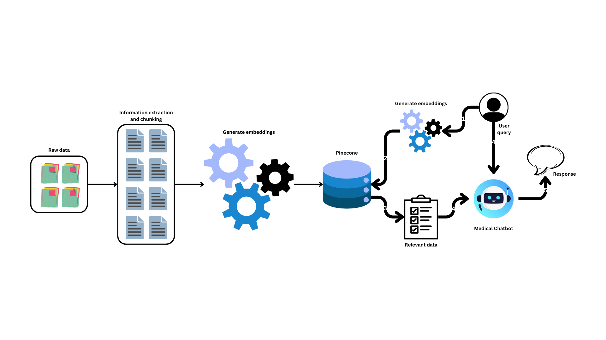

# Transforming Healthcare Accessibility with a RAG-Based Medical Chatbot

---

---

## Project Overview

In today’s fast-paced world, accessing accurate and timely medical information is critical. Our client, a leading U.S.-based healthcare organization, sought to revolutionize how patients interact with medical information by creating a **Retrieval-Augmented Generation (RAG)**-based chatbot. This chatbot aimed to deliver precise, context-aware answers, ensuring a user-friendly experience while adhering to strict healthcare regulations.

---

## Key Challenges

1. Providing accurate medical information from a vast corpus of PDF documents.
2. Ensuring the chatbot could understand context and offer conversational follow-ups.
3. Maintaining compliance with healthcare regulations while protecting sensitive data.
4. Offering multilingual support to cater to a diverse user base.

---

## Our Approach

- ** Dynamic Response Generation**  
  Used **LangChain** with the **OpenAI API** for generating coherent, context-sensitive responses.

- ** Smart Retrieval Layer**  
  Indexed medical documents using **Pinecone vector DB** and improved relevance with **MMR re-ranking**.

- ** Frontend Interface**  
  Designed an interactive UI using **Streamlit** for easy patient interaction.

- **☁ Cloud Deployment**  
  Deployed securely on **Azure App Services**, enabling scalable and global availability.

---

## Results

-  Delivered precise answers in under 2 seconds  
-  Reduced redundant questions to healthcare staff  
-  Boosted multilingual accessibility and trust  
-  Ensured complete data security and compliance  

---

## Tech Stack

| Component     | Tool / Framework         |
|--------------|--------------------------|
| LLM API      | OpenAI (GPT-3.5)         |
| Framework    | LangChain                |
| Vector Store | Pinecone                 |
| UI           | Streamlit                |
| Deployment   | Azure App Services       |
| Embedding    | `text-embedding-3-small` |

---

##  Highlights

-  Extracted & chunked thousands of PDF documents
-  Enabled intelligent follow-up questioning
-  Implemented multilingual support (EN, ES, UR)
-  Improved patient query resolution speed by >60%

---

> **Note**: The code for this project is confidential and owned by the client. This repository documents the architecture, methodology, and outcomes only.
